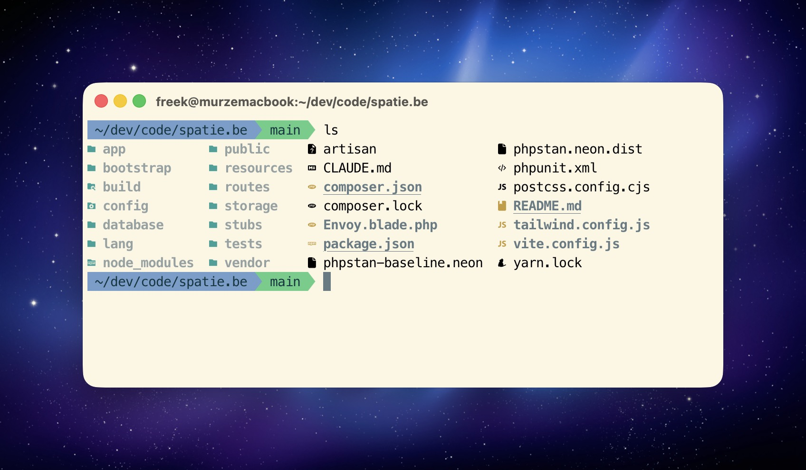

# My dotfiles



Personal dotfiles with modern shell tooling, optimized for Laravel/PHP development. Features fast startup times, smart directory navigation, and modern CLI tools.

## Key Features

- **Ghostty Terminal** - GPU-accelerated terminal with Claude Code optimized theme
- **Nuno Maduro Style** - Ultra-strict Laravel config templates (PHPStan max, Rector, Pint)
- **Custom Agnoster Theme** - Clean powerline prompt with no branch symbols, `•` for changes
- **Version-Controlled Skills & Agents** - All Claude Code skills and agents synced via dotfiles
- **Fast Tools** - fnm, zoxide, ripgrep, bat, eza, lazygit, btop (all Rust-based for speed)
- **JetBrainsMono Nerd Font** - Nuno Maduro's choice, size 23
- **One Command Install** - `bin/install` sets up everything including Claude Code

---

## Quick Start

```bash
git clone git@github.com:ismaildasci/dotfiles.git ~/.dotfiles
cd ~/.dotfiles
bin/install
```

---

## What's Included

### Shell & Prompt

- **Oh My Zsh** - Framework for managing Zsh configuration (with agnoster theme by default)
- **zoxide** - Smart directory jumping based on frecency
- **fzf** - Fuzzy finder for files and history
- **direnv** - Automatic environment variables per directory

### Modern CLI Replacements

| Old | New | Alias |
|-----|-----|-------|
| ls | eza | `ls`, `l`, `ll`, `lt` |
| cat | bat | `cat` |
| find | fd | - |
| grep | ripgrep | `grep` |
| cd | zoxide | `z`, `zi` |
| top/htop | btop | `top`, `htop` |
| du | dust | `du` |
| ps | procs | `ps` |

### TUI Tools

- **lazygit** (`lg`) - Git TUI
- **lazydocker** (`lzd`) - Docker TUI
- **yazi** (`y`) - File manager TUI

### Other Tools

- **fnm** - Fast Node.js version manager
- **fzf** - Fuzzy finder (Ctrl+R, Ctrl+T)
- **git-delta** - Better git diffs
- **jq** / **yq** - JSON/YAML processors
- **direnv** - Per-directory env vars

### Development Tools

- **PHP** - Managed via Laravel Herd
- **Composer** - Managed via Laravel Herd
- **Node.js** - LTS version managed via fnm
- **Laravel Herd** - Local development server (replaces Valet)
- **MySQL** - Database with auto-start

### QuickLook Plugins

Instant file previews in Finder: code files, markdown, JSON, CSV, patches, and archives.

---

## How It Works

### Symlinked Files

The installation creates symlinks from your home directory to the dotfiles repository. This allows you to version control your configuration while keeping files in their expected locations.

| Symlink Location | Points To | Purpose |
|-----------------|-----------|---------|
| `~/.zshrc` | `~/.dotfiles/home/.zshrc` | Main Zsh configuration (Oh My Zsh with custom agnoster theme) |
| `~/.gitconfig` | `~/.dotfiles/home/.gitconfig` | Git configuration with delta diff viewer |
| `~/.global-gitignore` | `~/.dotfiles/home/.global-gitignore` | Global Git ignore patterns |
| `~/.vimrc` | `~/.dotfiles/home/.vimrc` | Vim configuration |
| `~/.vim/` | `~/.dotfiles/home/.vim/` | Vim runtime files |
| `~/.mackup.cfg` | `~/.dotfiles/macos/.mackup.cfg` | Mackup backup configuration |
| `~/.config/ghostty/config` | `~/.dotfiles/config/ghostty/config` | Ghostty terminal configuration |
| `~/.claude/skills` | `~/.dotfiles/config/claude/skills/` | All Claude Code skills (version-controlled) |
| `~/.claude/agents` | `~/.dotfiles/config/claude/agents/` | All Claude Code agents (version-controlled) |
| `~/.claude/CLAUDE.md` | `~/.dotfiles/config/claude/CLAUDE.md` | Claude Code configuration |
| `~/.claude/laravel-php-guidelines.md` | `~/.dotfiles/config/claude/laravel-php-guidelines.md` | Laravel coding standards |
| `~/.claude/settings.json` | `~/.dotfiles/config/claude/settings.json` | Claude Code settings |

### Sourced Files

These files are loaded by `.zshrc` but remain in the dotfiles directory:

- `home/.aliases` - Shell command aliases
- `home/.functions` - Custom shell functions
- `home/.exports` - Environment variables

### Custom Agnoster Theme

The default configuration uses a customized agnoster theme stored in `oh-my-zsh-custom/themes/agnoster.zsh-theme`:

**Customizations:**
- No git branch symbol (cleaner look)
- Uses `•` for unstaged changes instead of `±`
- Powerline arrows for segment separators
- Requires Nerd Font with powerline glyphs

**Git Status Symbols:**
- `✚` - Staged changes (files added with `git add`)
- `•` - Unstaged changes (modified files not yet staged)
- Yellow background - Uncommitted changes
- Green background - Clean working directory

---

## Daily Usage

### Smart Navigation

```bash
z dotfiles          # Jump to frequently used directories
zi                  # Interactive directory picker
Ctrl+R              # Fuzzy search command history
Ctrl+T              # Fuzzy find files
Alt+C               # Fuzzy change directory
```

### Laravel/PHP Shortcuts

```bash
a                   # php artisan
p                   # Run Pest/PHPUnit tests
c                   # composer
mfs                 # php artisan migrate:fresh --seed
nah                 # git reset --hard; git clean -df
```

### Data Processing

```bash
# JSON processing with jq
curl api.github.com/users/ismaildasci | jq
cat composer.json | jq '.require'
php artisan tinker --execute="echo json_encode(User::first());" | jq

# YAML processing with yq
yq '.jobs' .github/workflows/ci.yml
yq -o json docker-compose.yml

# System monitoring
btop                # Modern system monitor
dust                # Disk usage
procs               # Process viewer

# TUI tools
lg                  # lazygit
lzd                 # lazydocker
y                   # yazi file manager
```

### Maintenance Commands

```bash
bin/update          # Update all packages and tools
```

---

## Version Management

### Node.js (via fnm)

```bash
fnm install --lts     # Install latest LTS
fnm use lts-latest    # Use latest LTS
fnm install 20        # Install specific version
fnm use 20            # Switch to specific version
fnm list              # Show installed versions
```

### PHP & Composer (via Laravel Herd)

PHP and Composer are managed via Laravel Herd. Use the Herd UI or CLI to:
- Switch PHP versions
- Enable/disable extensions (imagick, redis, xdebug)
- Update PHP and Composer

---

## Package Management

All Homebrew packages are declared in `config/Brewfile`. To add a new tool:

```bash
echo 'brew "neovim"' >> ~/.dotfiles/config/Brewfile
brew bundle --file=~/.dotfiles/config/Brewfile
```

**Complete package list:**

- **Core**: node, composer, pkg-config, wget, httpie, gh, 1password-cli, git-secret, imagemagick, mysql, yarn, ghostscript, mackup
- **Modern CLI**: eza, bat, fd, ripgrep, zoxide, fzf, git-delta, jq, yq
- **System Monitoring**: btop, dust, procs
- **TUI Tools**: lazygit, lazydocker, yazi
- **Development**: fnm, direnv
- **Claude Code**: `npm install -g @anthropic-ai/claude-code`
- **Fonts**: font-meslo-lg-nerd-font
- **QuickLook**: qlcolorcode, qlstephen, qlmarkdown, quicklook-json, qlprettypatch, quicklook-csv, betterzip, suspicious-package
- **PHP Extensions**: Managed via Laravel Herd (imagick, memcached, xdebug, redis)
- **Global Composer**: laravel/envoy, spatie/phpunit-watcher

---

## Claude Code Integration

### Quick Install (Standalone)

Install just Claude Code without the full dotfiles:

```bash
curl -fsSL https://raw.githubusercontent.com/ismaildasci/dotfiles/main/bin/install-claude-code | bash
```

### What's Included

- **Claude Code CLI** - Installed via npm (`@anthropic-ai/claude-code`)
- **Custom configuration** - CLAUDE.md with coding guidelines, laravel-php-guidelines.md
- **Version-controlled skills** - Entire `~/.claude/skills` directory symlinked to dotfiles
- **Version-controlled agents** - Entire `~/.claude/agents` directory symlinked to dotfiles

### Skills (Version Controlled)

All skills are stored in `config/claude/skills/` and version-controlled with your dotfiles. When you run the installer on a new Mac, all skills are immediately available.

**Custom Skills:**
- `ray-skill` - Ray debugging integration
- `fix-github-issue` - GitHub issue automation
- `convert-issue-to-discussion` - GitHub workflow helpers

**Community Skills:**
- `vercel-labs/agent-skills` - Web design guidelines and React best practices
- `anthropics/skills` - Frontend design and skill creation tools
- `vercel-labs/agent-browser` - Browser automation
- `expo/skills` - React Native with Expo
- `callstackincubator/agent-skills` - React Native performance
- `coreyhaines31/marketingskills` - Copywriting and programmatic SEO
- `copy-editing` - Marketing copy editing
- `copywriting` - Marketing copywriting
- `frontend-design` - Frontend design patterns
- `pdf` - PDF manipulation
- `seo-audit` - SEO auditing
- `web-design-guidelines` - Web design best practices

### Adding New Skills

```bash
# Install a new skill (adds directly to your dotfiles)
npx skills add <owner/repo>

# Commit to version control
cd ~/.dotfiles
git add config/claude/skills/
git commit -m "Add new skill"
git push
```

Browse more skills at [skills.sh](https://skills.sh)

### Agents (Version Controlled)

All custom agents are stored in `config/claude/agents/` and version-controlled with your dotfiles. When you run the installer on a new Mac, all agents are immediately available.

**Custom Agents:**
- `laravel-simplifier` - Simplifies and refines PHP/Laravel code for clarity and maintainability
- `laravel-debugger` - Diagnoses and fixes issues in Laravel applications
- `laravel-feature-builder` - Implements new features in Laravel applications
- `task-planner` - Breaks down complex tasks into actionable steps

---

## Customization

### Personal Aliases & Functions

Create custom configurations that won't be committed:

```bash
mkdir -p ~/.dotfiles-custom/shell
vim ~/.dotfiles-custom/shell/.aliases
```

These files are automatically loaded by `.zshrc` if they exist.

### Project-Specific Variables

Use `direnv` for automatic environment loading:

```bash
cd my-project
echo 'export DEBUG=true' > .envrc
direnv allow
```

Variables load when you enter the directory and unload when you leave.

---

## Laravel Project Templates (Nuno Maduro Style)

Copy these to any Laravel project for ultra-strict, type-safe development:

```bash
cp ~/.dotfiles/config/laravel/phpstan.neon ./
cp ~/.dotfiles/config/laravel/rector.php ./
cp ~/.dotfiles/config/laravel/pint.json ./
```

Then add dev dependencies and scripts from `config/laravel/composer-scripts.json`.

### What's Included

| File | Purpose |
|------|---------|
| `phpstan.neon` | Static analysis at level max |
| `rector.php` | Automated refactoring (PHP 8.4, Laravel 12) |
| `pint.json` | Strict code style with declare_strict_types |
| `composer-scripts.json` | dev, lint, test commands reference |

### Key Commands

```bash
composer dev        # Server + Queue + Logs + Vite concurrently
composer lint       # Rector + Pint + Prettier
composer test:types # PHPStan level max
composer test       # Full test suite with 100% coverage
```

---

## Post-Installation

1. **Open Ghostty** (already configured):
   - Font: JetBrainsMono Nerd Font, size 23
   - Theme: Custom Claude Code (dark + orange accents)
   - Quick Terminal: `Cmd + \`` for dropdown terminal

2. **Restore settings** (optional): Run `mackup restore` if you have backups

3. **Migrate history** (upgrading only): Run `migration/migrate-z-to-zoxide.sh` if you have `~/.z`

---

## Tool Comparisons

| Old Tool | New Tool | Why Better |
|----------|----------|------------|
| z.sh / autojump | zoxide | Smarter frecency algorithm, Rust speed |
| nvm | fnm | 40x faster, simpler, Rust-based |
| cat | bat | Syntax highlighting, git integration |
| ls | eza | Icons, tree view, git status |
| grep | ripgrep | 5-10x faster, respects .gitignore |
| find | fd | Simpler syntax, 10x faster |
| diff | delta | Side-by-side diffs, syntax highlighting |
| htop/top | btop | Better UI, graphs, Rust-based |
| du | dust | Visual disk usage, Rust-based |
| ps | procs | Colorful, searchable, Rust-based |
| git CLI | lazygit | Full TUI for git operations |
| docker CLI | lazydocker | Full TUI for docker management |
| ranger/mc | yazi | Blazingly fast file manager, Rust-based |

---

## Utilities

The `bin/` directory contains helper scripts:

- **install** - Main installation script (idempotent, safe to re-run)
- **install-claude-code** - Standalone Claude Code installer
- **update** - Update dotfiles, Homebrew, npm, and Composer packages
- **doctor** - Health check and diagnostic tool

---

## Migration Notes

If upgrading from an older setup:

1. **Directory history**: Run `migration/migrate-z-to-zoxide.sh` to import your `~/.z` data
2. **Prompt**: The default is now Oh My Zsh with custom agnoster theme
3. **Version managers**:
   - fnm replaces nvm for Node.js
   - Homebrew manages PHP/Composer (no more compilation or mise)
4. **Fonts**: Meslo Nerd Font replaces Menlo Powerline (installed via Brewfile)
5. **Claude Code Skills**: Now version-controlled in `config/claude/skills/` and symlinked to `~/.claude/skills`
6. **Claude Code Agents**: Now version-controlled in `config/claude/agents/` and symlinked to `~/.claude/agents`
7. **Custom Theme**: Custom agnoster theme stored in `oh-my-zsh-custom/themes/`

---

## My Projects

- **[vps-starter](https://github.com/ismaildasci/vps-starter)** - Production-ready VPS setup (Docker, Traefik, SSL, Monitoring)
- **[sapb1-laravel-sdk](https://github.com/ismaildasci/sapb1-laravel-sdk)** - SAP B1 Service Layer integration for Laravel
- **[sapb1-laravel-toolkit](https://github.com/ismaildasci/sapb1-laravel-toolkit)** - 54 Models, 110 Actions, 145+ DTOs for SAP B1

---

## Credits

Based on [Freek Van der Herten's dotfiles](https://github.com/freekmurze/dotfiles).

Created by [İsmail Daşcı](https://github.com/ismaildasci).

See `config/Brewfile` for complete package list.
